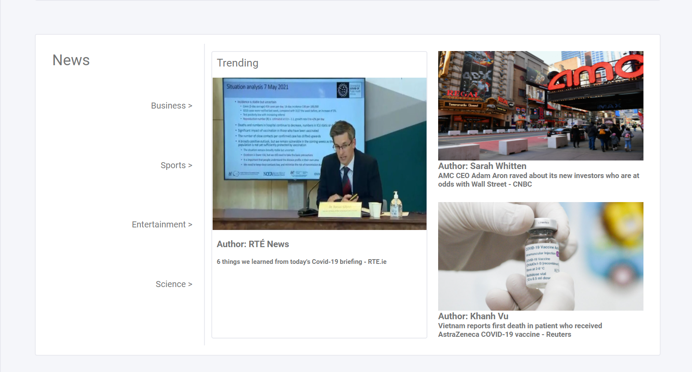
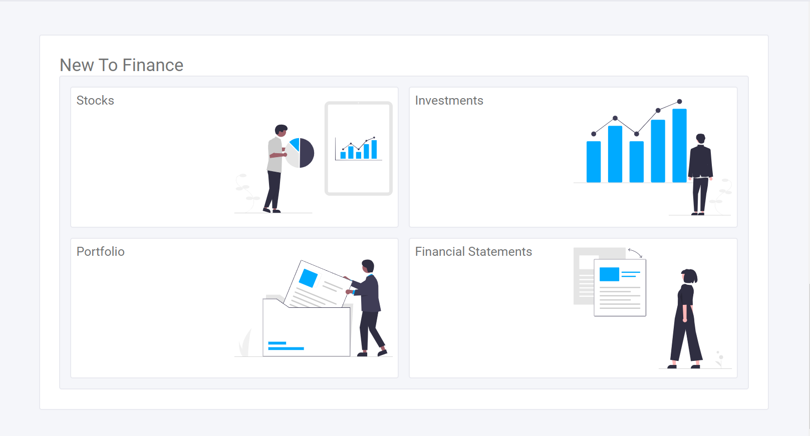
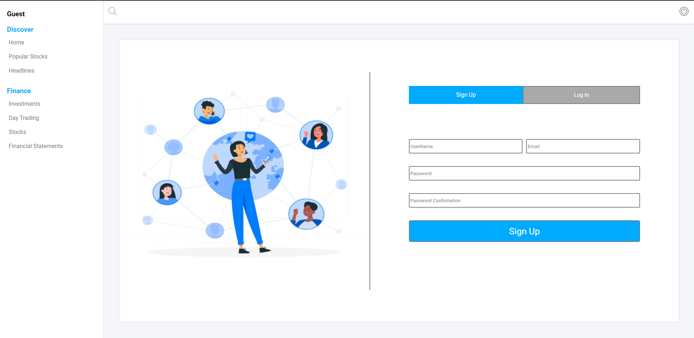
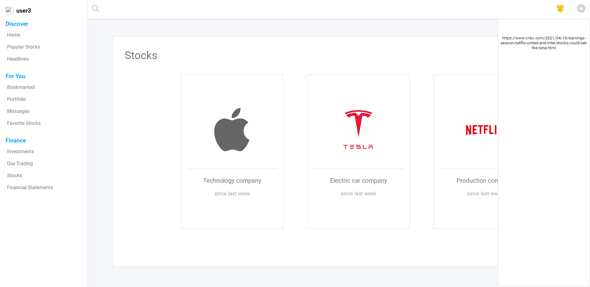
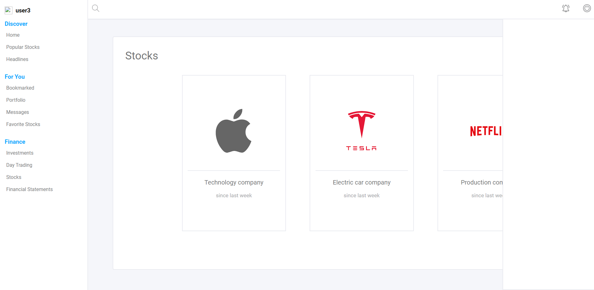
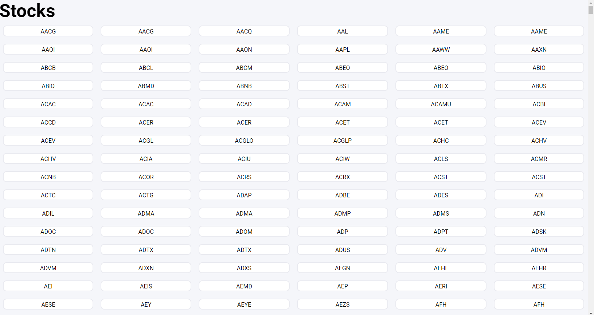
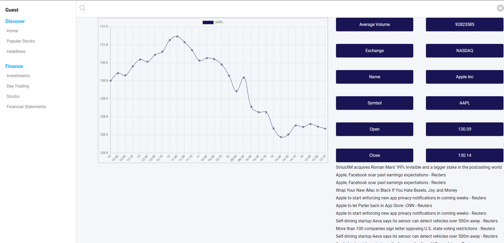

# Finance Network

https://user-images.githubusercontent.com/25377766/117483273-86852e00-af33-11eb-9348-6d8b69565b54.mp4

## Goal

To build a finance platformm where people with similar interest can go and explore new ideas and learn from their peers.

## The website

The website is built for users that want to learn or share their ideas related to the finance industry. With features such as being able to follow a user, to share and bookmark articles, you're able to create connections with others that share similar interest as yours.

### Homepage

This page shows all the sections a user can access.

### The Login Page

### The Sign Up

### Notification

When the user receives notifications the notification icon will light up.

When all the notifications are read the icon will change.

### Stocks

This page shows all the stocks in the NASDAQ from A-Z.

### Stock

Once a stock has be selected this page shows that stocks chart, news and fiancial information.

